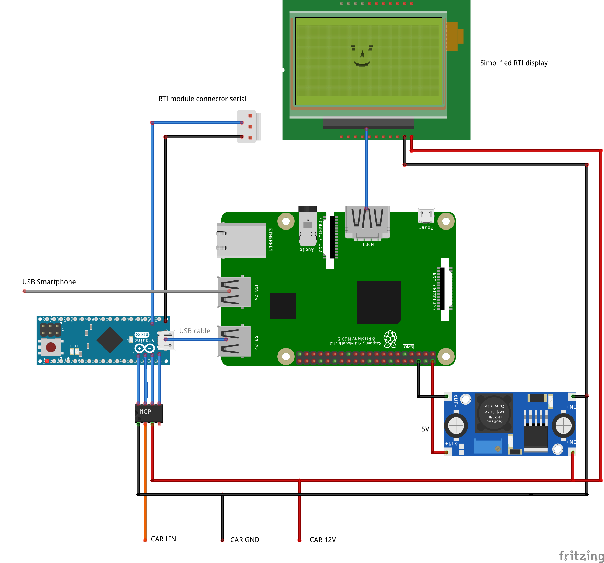

# Volvo V50 RTI + Crankshaft + Raspberry Pi + Arduino = ❤️

Run Android Auto on Volvo V50 RTI screen by retrofitting it with Raspberry Pi & [Crankshaft](https://getcrankshaft.com/).

[Photos and videos »](https://photos.app.goo.gl/vtM3ymQ5z1pJNeDw8)

## Features

- Steering wheel controls
- Open/close display when Android phone is plugged/unplugged

Missing / TODO:

- Automatic brightness adjustment using light sensor
- Sound output to the car stereo via RPi
- Microphone

I'm playing audio via Bluetooh audio adapter. 

## Ingredients

- Volvo V50
- [Raspberry Pi 3B](https://www.amazon.de/gp/search/ref=as_li_qf_sp_sr_tl?ie=UTF8&tag=laurynas-21&keywords=Raspberry+PI+3+B&index=aps&camp=1638&creative=6742&linkCode=ur2&linkId=e001c5f9f4d3f74b5c1dd16f6c332d13) or later
- [Arduino Pro Micro](https://www.amazon.de/gp/search/ref=as_li_qf_sp_sr_il_tl?ie=UTF8&tag=laurynas-21&keywords=Arduino+Pro+Micro&index=aps&camp=1638&creative=6742&linkCode=xm2&linkId=d4686b56fc385d159579ed4d5eef5ea8)
- [6.5" AT065TN14 800x480 LCD + driver board](https://www.amazon.de/gp/search/ref=as_li_qf_sp_sr_il_tl?ie=UTF8&tag=laurynas-21&keywords=AT065TN14&index=aps&camp=1638&creative=6742&linkCode=xm2&linkId=6e01e0dad15fba08e3fcbea8f2b6eccf). AT065TN14 exactly matches original RTI display dimentions (width x height). Also I found some alternatives - [thinner screen](https://www.aliexpress.com/item/4000329488912.html?spm=a2g0s.9042311.0.0.439c4c4dvR4vq8) and [smaller driver board with audio output](https://www.aliexpress.com/item/4001175095149.html?spm=a2g0s.9042311.0.0.439c4c4dvR4vq8).
- MCP2004 LIN bus transceiver. Or compatible like [MCP2003](https://amzn.to/3rwwUKv), [MCP2025](https://www.amazon.de/gp/search/ref=as_li_qf_sp_sr_tl?ie=UTF8&tag=laurynas-21&keywords=MCP2025&index=aps&camp=1638&creative=6742&linkCode=ur2&linkId=cf9ec269986e3037d6f886c80946ed53).
- 12V -> 5V step down converter, like [XL4005](https://www.amazon.de/gp/search/ref=as_li_qf_sp_sr_il_tl?ie=UTF8&tag=laurynas-21&keywords=XL4005&index=aps&camp=1638&creative=6742&linkCode=xm2&linkId=eb52987620732e0b3498814cf89e6b3a) or [LM2596](https://www.amazon.de/gp/search/ref=as_li_qf_sp_sr_il_tl?ie=UTF8&tag=laurynas-21&keywords=LM2596&index=aps&camp=1638&creative=6742&linkCode=xm2&linkId=b877bd309a1e1d59cda432af439f6d30). I would choose 5amps instead of 3amps.
- [HDMI slim flat FPC cable](https://amzn.to/3hjNZCM)
- [USB extension cable](https://www.amazon.de/gp/search/ref=as_li_qf_sp_sr_il_tl?ie=UTF8&tag=laurynas-21&keywords=USB+extension+cable&index=aps&camp=1638&creative=6742&linkCode=xm2&linkId=855fc94e9bb2ae16bfbce0f68ece176d)
- [Micro USB to USB cable](https://www.amazon.de/gp/search/ref=as_li_qf_sp_sr_il_tl?ie=UTF8&tag=laurynas-21&keywords=Micro+USB+to+USB+flat+cable&index=aps&camp=1638&creative=6742&linkCode=xm2&linkId=06dc1a5da441e191d22304bfa2641932)

## Overview

This is just a rough scheme showing how main components are connected. 

Raspberry Pi is running [Crankshaft](https://getcrankshaft.com/) which enables Android Auto support.

Arduino is listening for steering wheel button events via [LIN bus](https://github.com/laurynas/volvo_linbus) transceiver. It converts these events to keyboard / mouse HID events and sends to Raspberry Pi via USB.

Via the same USB cable Raspberry Pi is sending phone state to Arduino.

Arduino is sending [serial events](https://github.com/laurynas/volvo#screen-control-signal) to Volvo RTI screen module and controls opening / closing of the screen.

Original RTI screen is replaced with AT065TN14 and connected to RPi using HDMI cable. Driver board is powered by 12V from RTI screen module.

RPi is powered from step down converter which converts 12V from the car to 5V.

## Configure Arduino

Build and upload [volvo_crankshaft.ino](volvo_crankshaft.ino) to Arduino.

## Configure RPi / Crankshaft

Copy files from [crankshaft/](crankshaft/) to RPi.

Enable serial service

> systemctl enable volvo_crankshaft

> systemctl start volvo_crankshaft 

### Configure Crankshaft

1. Enable keyboard controls
2. Disable audio (I'm playing audio via bluetooth adapter)

## Alternative - Using original RTI LCD display

I have also succeeded using original LCD display too. [More details in the wiki »](https://github.com/laurynas/volvo_crankshaft/wiki/Using-original-RTI-LCD-display).

## Links

- [Volvo V50 LIN bus reader](https://github.com/laurynas/volvo_linbus) - reading steering wheel controls
- [Volvo V50 RTI screen with Arduino controls](https://github.com/laurynas/volvo) - sending serial + VGA signals to original RTI screen
- [Volvo V50 RTI screen removal](https://www.youtube.com/watch?v=MJirMelq5ys)
- [Volvo V50 waterfall panel/radio removal](https://www.youtube.com/watch?v=Xo5NpBt04qs)
