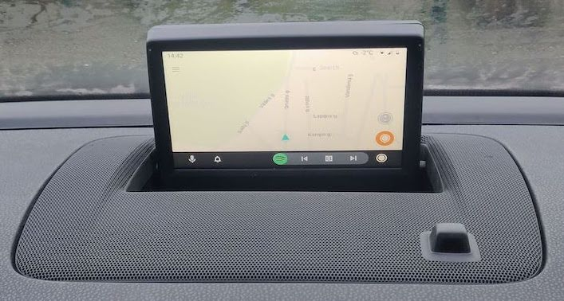

# Volvo V50 RTI + Crankshaft + Raspberry Pi + Arduino = ❤️

Replacing Volvo V50 RTI screen with Raspberry Pi & Crankshaft which allows running Android Auto on
the RTI screen.

Work in progress...

## Features

- Steering wheel controls
- Auto-open display when Android phone is connected to USB

Missing / TODO:

- Automatic brightness adjustment using light sensor
- Sound output to the car stereo via RPi
- Microphone

## Ingredients

- Volvo V50
- Raspberry Pi 3B
- Arduino Pro Micro
- 6.5" AT065TN14 800x480 LCD + driver board
- MCP2004 LIN bus transceiver (or any compatible like MCP2003, MCP2025)
- 12V -> 5V step down converter, like XL4005 or LM2596. I would choose 5amps instead of 3amps.
- HDMI slim flat cable
- USB extension cable

## Configure Arduino

Build and upload [volvo_crankshaft.ino](volvo_crankshaft.ino) to Arduino Pro Micro.

## Configure RPi / Crankshaft

Copy files from [crankshaft/](crankshaft/) to RPi.

Enable serial service

> systemctl enable volvo_crankshaft

> systemctl start volvo_crankshaft 

## Connect wires

1. Connect Arduino to RPi using USB cable.

## Links

- [Volvo V50 LIN bus reader](https://github.com/laurynas/volvo_linbus) - reading steering wheel controls
- [Volvo V50 RTI screen with Arduino controls](https://github.com/laurynas/volvo) - sending serial + VGA signals to original RTI screen
